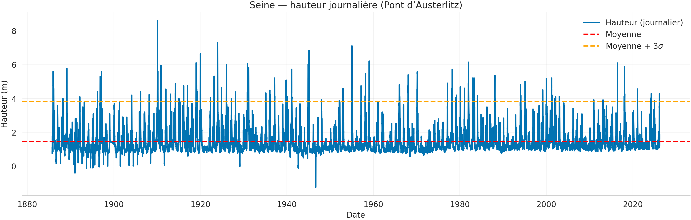
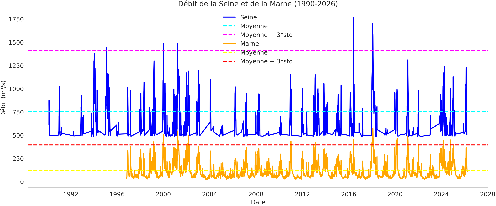
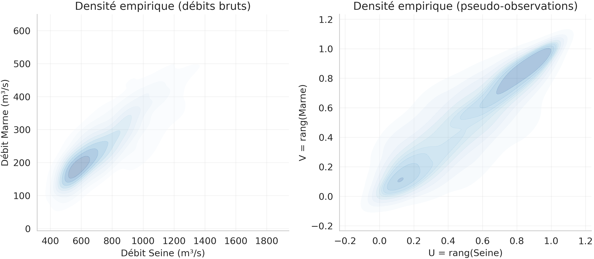
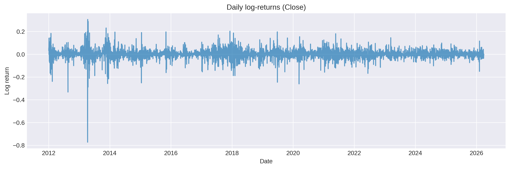
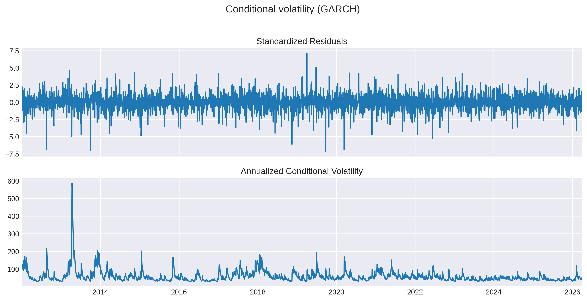
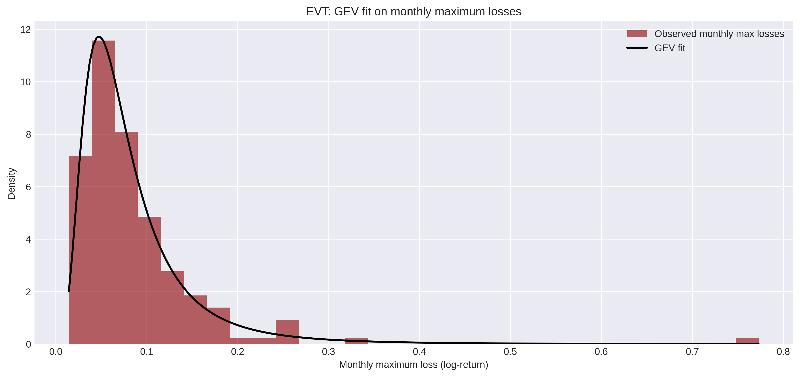
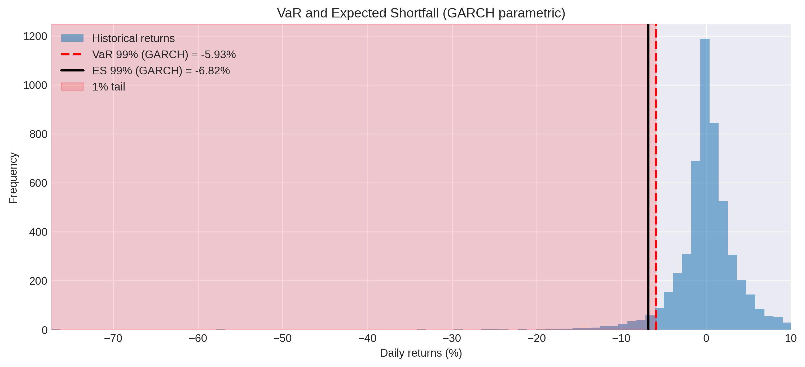
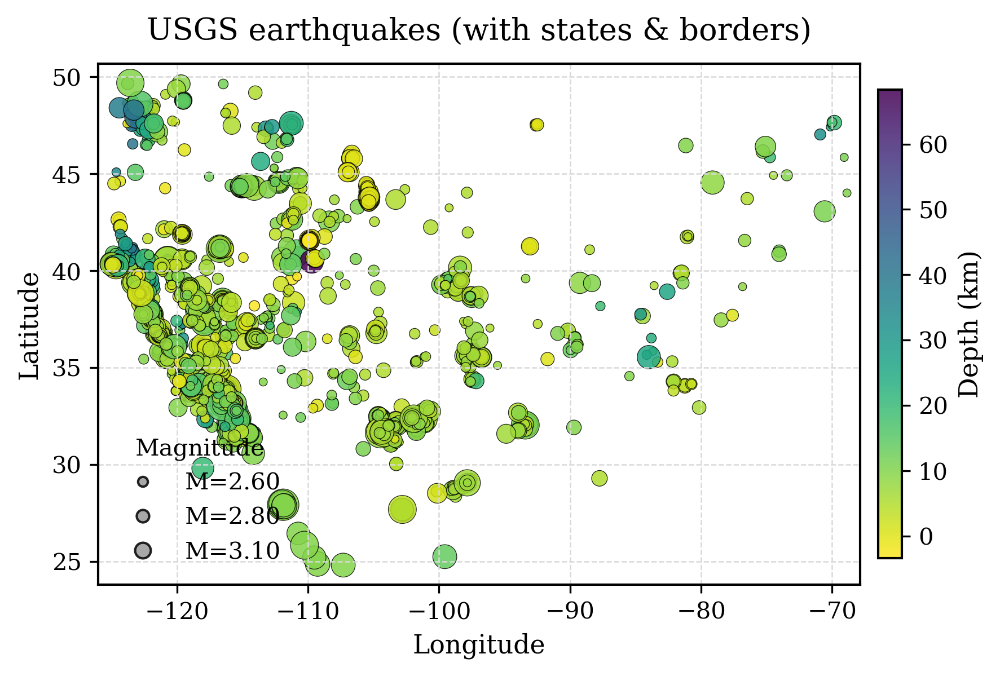
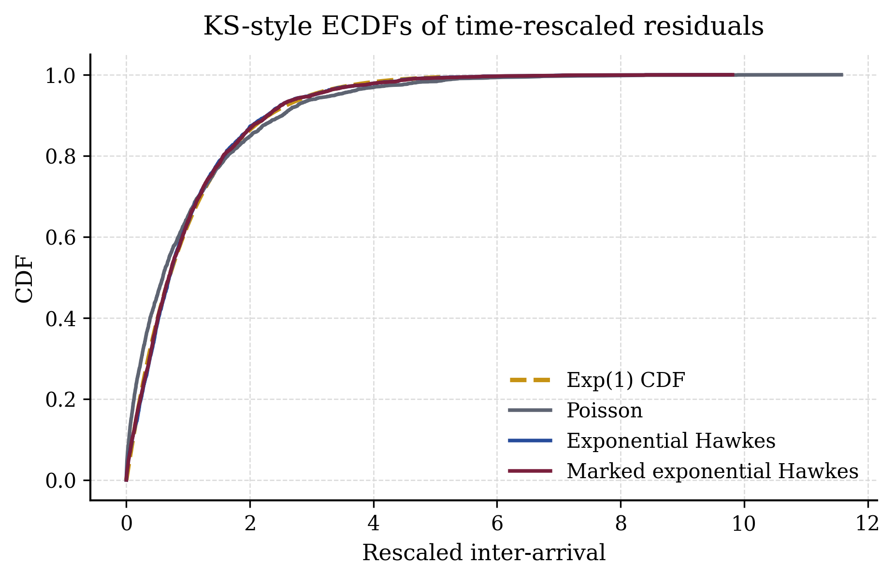
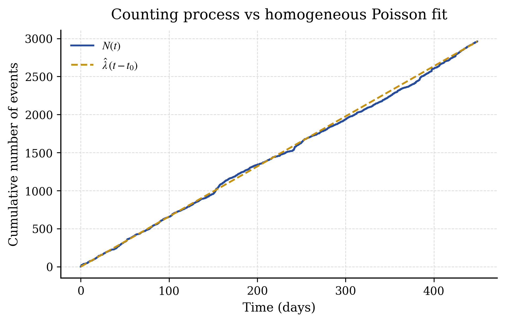

# Statistical Modelling — Course Project (X / Rosenbaum)

This repository contains our course project for **Modélisation aléatoire, statistiques et processus stochastiques** (Prof. Rosenbaum, École Polytechnique).

It is organized as **three independent empirical studies** on real-world datasets:

1. **Seine & Marne** — Extreme quantile estimation (EVT) and **tail dependence** via Archimedean copulas.
2. **Crypto (Bitcoin)** — Time-series modelling via **ARIMA–GARCH(1,1)–EVT**, with risk measures (VaR / ES).
3. **Earthquakes (USGS)** — Point process modelling via **Poisson vs Hawkes processes**, validated with residual diagnostics.

The corresponding written report is available here:

- [`Memoire_statistique.pdf`](Memoire_statistique.pdf)

Authors (as per the mémoire): Florentin Acker, Hubert Leroux, Jean Marcus.

---

## Quickstart

This repo is mostly **notebook-driven** (Seine/Marne + Crypto) plus one **Python script pipeline** (Earthquakes).

### 1) Create a virtual environment (recommended)

```bash
python -m venv .venv
source .venv/bin/activate
python -m pip install -U pip
```

### 2) Install dependencies

Earthquakes has a pinned requirements file:

```bash
pip install -r earthquakes/requirements.txt
```

For the notebooks (Seine/Marne + Crypto), you’ll typically also need:

```bash
pip install jupyter seaborn statsmodels arch copulas kagglehub
```

Notes:

- `kagglehub` is used by the crypto notebook to fetch a dataset.
- `cartopy` is optional (only used to draw state/country boundaries on the earthquake map). If you want it:

```bash
pip install cartopy
```

---

## Repository structure

```text
.
├── Memoire_statistique.pdf
├── README.md
├── crypto/
│   └── crypto.ipynb
├── seine_et_marne/
│   ├── utils.py
│   ├── copules.ipynb
│   ├── quantile_extreme-dahti.ipynb
│   ├── quantile_extreme-eau_france.ipynb
│   ├── data/
│   └── figures/
│       ├── copules/
│       └── quantiles_extremes/
└── earthquakes/
    ├── main.py
    ├── requirements.txt
    ├── data/
    ├── figures/
    └── src/
        ├── models.py
        ├── estimation.py
        ├── diagnostics.py
        ├── metrics.py
        └── plotting.py
```

---

## Project 1 — Seine & Marne (EVT + Copulas)

**Goal.** Estimate **extreme quantiles** of the Seine water level at Pont d’Austerlitz (long historical series) and study the **joint tail dependence** between the Seine and the Marne (river discharge), using copulas.

**Methods (high-level).**

- Univariate EVT:
  - block maxima with **GEV**,
  - threshold exceedances with **KDE + GPD** (semi-parametric).
- Bivariate dependence:
  - Archimedean copulas (e.g. **Clayton**, **Gumbel**) fitted to pseudo-observations,
  - tail dependence assessment (the mémoire reports strong upper-tail dependence).

**Where to run it.**

- `seine_et_marne/quantile_extreme-*.ipynb`
- `seine_et_marne/copules.ipynb`

### Highlights (Seine/Marne figures)

**Extreme quantiles (Seine).**



**Copulas & dependence (Seine/Marne).**





---

## Project 2 — Crypto (Bitcoin) (ARIMA–GARCH–EVT)

**Goal.** Model Bitcoin price dynamics (2012–2026) with a full pipeline capturing:

- non-stationarity (ARIMA),
- conditional heteroscedasticity (GARCH(1,1)),
- heavy tails on residuals (EVT),

and produce operational risk measures (**Value-at-Risk** and **Expected Shortfall**, typically at 99% confidence, as described in the mémoire).

**Where to run it.**

- `crypto/crypto.ipynb`

**How to run.**

```bash
jupyter lab
```

Then open `crypto/crypto.ipynb` and run all cells (the notebook includes install hints and data download logic).

### Highlights (Crypto figures)

**Daily log-returns** (a first look at volatility clustering).



**Conditional volatility (GARCH(1,1))**.



**EVT on monthly maximum losses** (GEV fit).



**Risk metrics (VaR / ES at 99%)**.



---

## Project 3 — Earthquakes (USGS) (Poisson vs Hawkes)

**Goal.** Fit and compare temporal point-process models on a USGS earthquake catalogue (USA, 2025–2026):

- homogeneous Poisson,
- Hawkes processes (exponential / power-law kernels),
- marked variants (triggering depends on magnitude).

The mémoire concludes that **marked exponential Hawkes** is the most adequate model according to residual diagnostics (time-rescaling).

**Run.**

```bash
cd earthquakes
python main.py
```

Figures are written to `earthquakes/figures/`.

### Highlights (Earthquakes figures)

**Where are the earthquakes?** (marker size = magnitude, color = depth)



**Model diagnostics** (time-rescaling checks)





---

## Data sources

- Seine / Marne hydrometry: EAUFRANCE / Hydro (see `seine_et_marne/data/provenance_donnees.md`).
- Earthquakes: USGS Earthquake Hazards Program (see `earthquakes/README.md`).

## Reproducibility notes

- Notebooks may require internet access for some downloads.
- If your environment struggles to install `cartopy`, you can still generate the earthquake map (it will fall back to a plain lon/lat plot without administrative boundaries).


